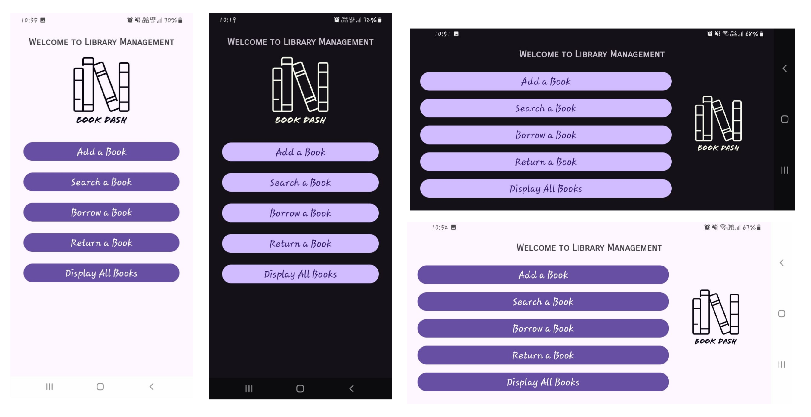
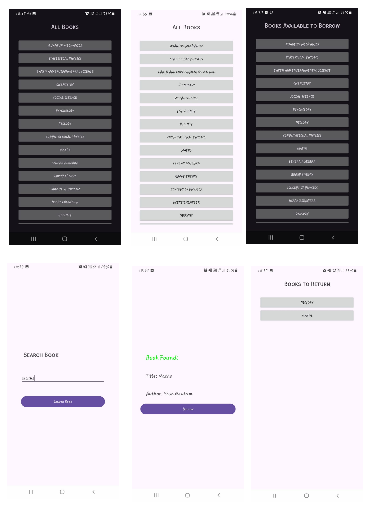

# Library-Management-System
This project was a learning project which showcases the library management system with functionalities like borrowing, returning, adding books.
No problem\! Adding those details will make the README even more informative. Here's the updated version:

-----

# BOOK DASH 📚 (ReadMe generate using Gemini)

BOOK DASH is an intuitive Android application designed to streamline library management tasks. This app provides a user-friendly interface for managing books within a library system, offering core functionalities to add, search, borrow, return, and display all available books.

**This project was developed as a practice application to explore and solidify Android development skills.**

## ✨ Features

  * **Add a Book:** Easily add new book entries to the library database by specifying the **Title** and **Author** of the book.
  * **Search a Book:** Quickly find books in the library by searching based on their **Title**.
  * **Borrow a Book:** Facilitate the borrowing process for users. Only books marked as "available" can be borrowed.
  * **Return a Book:** Manage the return of borrowed books, updating their status back to "available" in the library system.
  * **Display All Books:** View a comprehensive list of all books currently stored in the application's database, along with their availability status.
  * **Responsive Layout:** Seamlessly adapts to both **portrait** and **landscape** screen orientations for an optimal user experience on various devices.

## 🚀 Technologies Used

  * **Android Studio**
  * **Java** for logic
  * **XML** for UI Layouts

## 📱 Screenshots





## ⚙️ Installation

To get a local copy up and running, follow these simple steps.

1.  **Clone the repository:**

    ```bash
    git clone https://github.com/Saaj369/Library-Management-System.git
    ```

2.  **Open in Android Studio:**

      * Open Android Studio.
      * Click on `File > Open` and navigate to the cloned `BookDash` directory.
      * Let Gradle sync the project.

3.  **Run on an emulator or physical device:**

      * Connect your Android device or start an AVD (Android Virtual Device).
      * Click on the `Run` button (green play icon) in Android Studio.

-----

## 🤝 Contributing

This project is primarily for personal learning and practice. However, if you have suggestions for improvements or want to contribute, feel free to open an issue or pull request\!

1.  Fork the Project
2.  Create your Feature Branch (`git checkout -b feature/AmazingFeature`)
3.  Commit your Changes (`git commit -m 'Add some AmazingFeature'`)
4.  Push to the Branch (`git push origin feature/AmazingFeature`)
5.  Open a Pull Request

-----

## 📄 License

Distributed under the MIT License. See `LICENSE` for more information.

-----

## ✉️ Contact

Sajan Daheriya - (mailto:saajdaheriya@gmail.com)

Project Link: [https://github.com/Saaj369/Library-Management-System.git](https://github.com/Saaj369/Library-Management-System.git)

-----
